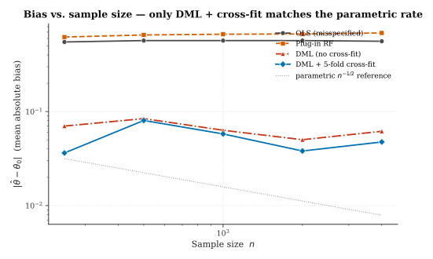

::: {.callout-note title="Intended learning outcomes"}
By the end of this chapter, you will be able to:

1. **Define** the partially linear causal model and state the regularity conditions required for $\sqrt n$-consistent inference on the treatment coefficient.
2. **Derive** the Neyman-orthogonality property of the DML moment condition and explain why it neutralizes first-order nuisance error.
3. **Compute** DML point estimates and standard errors by hand for a small, simulated dataset.
4. **Apply** cross-fitting to avoid own-observation bias when the nuisance functions are fit with flexible machine-learning regressors.
5. **Diagnose** the three most common empirical failure modes: weak propensity overlap, slow nuisance convergence rates, and residual correlation with the instrument.
6. **Evaluate** whether a given applied problem satisfies the DML assumptions or requires an alternative identification strategy.
:::

::: {.callout-tip title="Suggested lecture plan" collapse="true"}
This chapter covers approximately **three lectures of 75–90 minutes each**. Hands-on segments assume students have a basic familiarity with `scikit-learn` and `statsmodels`.

**Lecture 1, From the plug-in to the orthogonal score.**

- Motivating example: the wage-experience regression with many confounders (10 min)
- The partially linear model and what makes it hard (15 min)
- Why the naive plug-in has $\sqrt n$-level bias (25 min)
- Neyman orthogonality, defined and verified (20 min)
- Hands-on: simulate the plug-in bias at $n = 500$ and $n = 5000$ (15 min)

**Lecture 2, Cross-fitting and the DML estimator.**

- The own-observation bias problem, explained on a single fold (10 min)
- K-fold cross-fitting as a data-efficient solution (20 min)
- The full DML algorithm, written out as pseudocode (15 min)
- Asymptotic variance and the $\sqrt n$ theorem (20 min)
- Hands-on: implement DML from scratch in 40 lines of Python (20 min)

**Lecture 3, When DML breaks.**

- Overlap violations and the $1 / \hat m (1 - \hat m)$ catastrophe (20 min)
- Rate conditions and what "slow learners" implies practically (20 min)
- Diagnostics: propensity histograms, out-of-fold loss, sensitivity analysis (20 min)
- Instrument-variable and partially linear IV extensions (15 min)
- Reading group discussion of a recent applied DML paper (15 min)
:::

::: {.callout-note title="Notation"}
Throughout this chapter, $Y$ denotes the scalar outcome, $D$ the scalar treatment, $X \in \mathbb{R}^p$ the covariate vector. Subscripts like $Y_i$ index observations, $i = 1, \ldots, n$. The target parameter is $\theta_0$; estimators are $\hat\theta$. Nuisance functions are $\ell_0(x) = \mathbb{E}[Y \mid X = x]$ and $m_0(x) = \mathbb{E}[D \mid X = x]$, with estimators $\hat\ell, \hat m$. The orthogonalized residual is $\tilde W = W - \hat h(X)$ for any variable $W$ and nuisance function $h$. All expectations are over the data-generating distribution $P_0$.
:::

## The plug-in trap {#sec-plugin-trap}

Suppose you have panel data on $n$ workers and want to estimate the wage return to an extra year of experience, controlling for education, industry, region, and job tenure. You run a modern pipeline: a gradient-boosted regressor predicts $\log(\text{wage})$ from all the controls, and then you fit the experience coefficient on the residuals. The algorithm is easy to implement, the predictions look good, and the resulting coefficient even comes with a clean standard error from a classical regression of residuals on experience.

This is the plug-in estimator, and if the controls are more than a handful of variables, it is **biased at order $n^{-1/2}$**, the exact order at which asymptotic confidence intervals lose their coverage guarantee. The problem is not sampling noise, which vanishes with more data, and it is not a bug in the machine-learning fit. It is the cost of doing nonparametric regression in the presence of a finite-dimensional target.

Chernozhukov and co-authors solved this problem in 2018 with a combination of two ideas, both classical in origin but previously never combined. This chapter derives both from first principles and shows how to implement them in around forty lines of code.

### The partially linear model

The simplest setting in which the issue is both important and tractable is the **partially linear model**:

$$
Y = \theta_0 D + g_0(X) + U, \qquad \mathbb{E}[U \mid D, X] = 0,
$$ {#eq-plm-y}

$$
D = m_0(X) + V, \qquad \mathbb{E}[V \mid X] = 0.
$$ {#eq-plm-d}

The target $\theta_0$ is the average effect of a unit change in $D$ on $Y$, holding $X$ fixed. The nuisance functions $g_0$ (outcome regression on $X$) and $m_0$ (treatment propensity given $X$) are unknown and can be arbitrarily rich. Equations @eq-plm-y and @eq-plm-d together imply $\mathbb{E}[U \mid X] = 0$, which we will use in the derivations to follow.

The partially linear model is not the only setting where DML applies, the same machinery extends to interactive regression, instrumental variables, and quantile models, but it is by far the cleanest place to see the mechanics.

### Why the naive plug-in fails {#sec-naive-bias}

Consider estimating $g_0$ by a flexible machine-learning regression $\hat g$ on the full dataset, and then fitting $\theta$ by regressing $Y - \hat g(X)$ on $D$:

$$
\hat\theta_{\text{plug-in}} = \frac{\frac{1}{n} \sum_i D_i (Y_i - \hat g(X_i))}{\frac{1}{n} \sum_i D_i^2}.
$$ {#eq-plugin-def}

To see what goes wrong, write $Y_i - \hat g(X_i) = \theta_0 D_i + U_i + (g_0(X_i) - \hat g(X_i))$. The numerator of @eq-plugin-def becomes

$$
\tfrac{1}{n} \sum_i D_i U_i \;+\; \theta_0 \tfrac{1}{n} \sum_i D_i^2 \;+\; \tfrac{1}{n} \sum_i D_i (g_0(X_i) - \hat g(X_i)).
$$

Dividing by $\tfrac{1}{n} \sum_i D_i^2 \to \mathbb{E}[D^2]$ and rearranging,

$$
\sqrt n (\hat\theta_{\text{plug-in}} - \theta_0) = \frac{\tfrac{1}{\sqrt n} \sum_i D_i U_i}{\mathbb{E}[D^2]} \;+\; \underbrace{\frac{\sqrt n \cdot \tfrac{1}{n} \sum_i D_i (g_0(X_i) - \hat g(X_i))}{\mathbb{E}[D^2]}}_{\text{bias term}} + o_P(1).
$$ {#eq-plugin-bias}

The first term has a classical Gaussian limit, it is the sampling fluctuation of an IID average. The bias term is the problem. Decomposing $D_i = m_0(X_i) + V_i$, the bias further splits into

$$
\frac{1}{\sqrt n} \sum_i V_i (g_0(X_i) - \hat g(X_i)) \;+\; \sqrt n \cdot \tfrac{1}{n} \sum_i m_0(X_i) (g_0(X_i) - \hat g(X_i)).
$$ {#eq-bias-split}

The first part in @eq-bias-split vanishes because $V_i$ is mean zero given $X_i$. The second part is a *deterministic* function of $X$, so it converges at the rate at which $\hat g$ approximates $g_0$, typically $n^{-\alpha}$ for some $\alpha < 1/2$ when using machine-learning regressors. Multiplying by $\sqrt n$ blows this up to infinity unless $\alpha > 1/2$, which nonparametric rates do not reach.

This is the nuisance-error blow-up. It does not go away with more data, and it does not go away with a better regressor (so long as the regressor remains slower than parametric). The $\sqrt n$-scaling target parameter is fighting the non-$\sqrt n$-scaling nuisance residual, and it loses.

::: {.callout-important title="The hidden assumption of classical econometrics"}
Classical semiparametric theory assumed that nuisance functions were estimated at parametric ($n^{-1/2}$) rate by sieve or kernel methods with bandwidths tuned to achieve this rate. Machine learning does not automatically give you these rates. Lasso, random forests, gradient boosting, and neural networks all converge at rates strictly slower than $n^{-1/2}$ in their standard formulations. DML is the repair for using these methods in a causal estimation pipeline.
:::

## Neyman orthogonality {#sec-orthogonality}

The fix is to replace the moment condition in @eq-plugin-def with one that is *insensitive* to first-order perturbations of the nuisance estimator. This is the property of **Neyman orthogonality**, first introduced by Neyman in 1959 in a different context (constructing test statistics robust to nuisance estimation), and rediscovered by Chernozhukov et al. for causal estimation.

### The orthogonal score

For the partially linear model, the Neyman-orthogonal moment condition is

$$
\psi(W; \theta, \eta) = \bigl(Y - \ell(X) - \theta (D - m(X))\bigr)(D - m(X)),
$$ {#eq-ortho-score}

where $W = (Y, D, X)$ is the observation, $\eta = (\ell, m)$ is the nuisance pair, and $\ell_0(x) = \mathbb{E}[Y \mid X = x] = \theta_0 m_0(x) + g_0(x)$. Setting this score to zero and solving for $\theta$ gives the estimator

$$
\hat\theta = \frac{\sum_i (Y_i - \hat\ell(X_i))(D_i - \hat m(X_i))}{\sum_i (D_i - \hat m(X_i))^2}.
$$ {#eq-dml-estimator}

This is a *partialling-out* regression: both $Y$ and $D$ are orthogonalized with respect to $X$ first, then the target coefficient is estimated by regressing the residual of $Y$ on the residual of $D$. The estimator is sometimes called Robinson's double-residual estimator, in recognition of the 1988 paper where Peter Robinson first proposed it for kernel-based nuisance estimation.

### Verifying orthogonality {#sec-verify-ortho}

Let $\eta_0 = (\ell_0, m_0)$ be the true nuisances. We claim that the Gateaux derivative of $\mathbb{E}[\psi(W; \theta_0, \eta)]$ with respect to $\eta$, evaluated at $\eta_0$, vanishes:

$$
\frac{\partial}{\partial t} \, \mathbb{E}[\psi(W; \theta_0, \eta_0 + t(\tilde\ell - \ell_0, \tilde m - m_0))] \Bigg|_{t=0} = 0, \quad \forall \tilde\ell, \tilde m.
$$ {#eq-neyman-def}

Computing the derivative in @eq-neyman-def and evaluating at $t = 0$, we get

$$
-\mathbb{E}[(D - m_0(X))(\tilde\ell(X) - \ell_0(X))] \;-\; \mathbb{E}[(Y - \ell_0(X) - \theta_0(D - m_0(X)))(\tilde m(X) - m_0(X))] \;+\; \text{higher order}.
$$

The first term is zero because $\mathbb{E}[D - m_0(X) \mid X] = 0$ by definition of $m_0$. The second is zero because $Y - \ell_0(X) - \theta_0(D - m_0(X)) = U$ and $\mathbb{E}[U \mid X] = 0$. Hence the Gateaux derivative vanishes at the truth, which is what we wanted.

::: {.callout-note title="Intuition"}
Orthogonality says: small errors in $\hat\ell$ do not couple to errors in $\hat m$ in the leading term of the bias. The cross-product of two small errors is second-order, and $\sqrt n$ times a second-order term vanishes. The plug-in score in @eq-plugin-def fails this property because the nuisance $\hat g$ is not orthogonal to the target direction.
:::

### The rate condition {#sec-rate-condition}

Orthogonality buys us the following quantitative guarantee. If

$$
\| \hat\ell - \ell_0 \|_{L_2} \cdot \| \hat m - m_0 \|_{L_2} = o_P(n^{-1/2}),
$$ {#eq-rate-condition}

then the DML estimator $\hat\theta$ is asymptotically normal with the same variance as the oracle estimator that knows $\eta_0$ exactly. Each nuisance needs to converge at rate $n^{-1/4}$, not $n^{-1/2}$. This is a slower rate, and it is achievable by lasso (under sparsity), random forests (under smoothness), and modern deep nets on reasonable problem classes.

The moment condition does the work that the rate cannot.

## The cross-fitting fix {#sec-crossfitting}

One more problem remains. If we fit $\hat\ell$ and $\hat m$ on the same data we use to evaluate the moment condition, then own-observation effects contaminate the score. The training data "leaks" into the fit through the regularization path, and the residuals $Y_i - \hat\ell(X_i)$ on training observations are systematically smaller than on out-of-sample observations. This is the *overfitting bias* of the nuisance estimator.

The fix is cross-fitting. Split the sample into $K$ folds, and for each fold $k$:

1. Fit $\hat\ell^{(-k)}$ and $\hat m^{(-k)}$ on the $K-1$ folds **other than** $k$.
2. Evaluate residuals $Y_i - \hat\ell^{(-k)}(X_i)$ and $D_i - \hat m^{(-k)}(X_i)$ on fold $k$.
3. Aggregate across folds to form the estimating equation.

The cross-fitted estimator is

$$
\hat\theta_{\text{CF}} = \frac{\sum_{k=1}^K \sum_{i \in \mathcal{I}_k} (Y_i - \hat\ell^{(-k)}(X_i))(D_i - \hat m^{(-k)}(X_i))}{\sum_{k=1}^K \sum_{i \in \mathcal{I}_k} (D_i - \hat m^{(-k)}(X_i))^2}.
$$ {#eq-dml-cf}

Each residual uses a nuisance fit that never saw that observation. The leave-one-fold-out structure eliminates overfitting bias at the cost of a constant factor of data efficiency. With $K = 5$ folds, each nuisance is fit on 80 percent of the data, plenty for nonparametric regression in all but the smallest samples.

::: {.callout-warning title="Non-standard cross-fitting is not the same"}
Cross-validation, tuning hyperparameters on held-out data, does not provide cross-fitting. The key distinction is that in cross-fitting, the *prediction* on fold $k$ uses a model that never saw fold $k$, whereas in cross-validation, the final model is typically re-fit on all the data. For DML, you need cross-fitting. Confusing the two has been a source of replication errors in applied papers.
:::

## The DML algorithm {#sec-algorithm}

Combining orthogonality and cross-fitting gives the full DML procedure:

1. Choose $K$ (typically 5). Randomly partition $\{1, \ldots, n\}$ into folds $\mathcal{I}_1, \ldots, \mathcal{I}_K$.

2. For each fold $k = 1, \ldots, K$:
   - Fit $\hat\ell^{(-k)}$ by regressing $Y$ on $X$ using observations not in $\mathcal{I}_k$.
   - Fit $\hat m^{(-k)}$ by regressing $D$ on $X$ using observations not in $\mathcal{I}_k$.

3. For each $i \in \mathcal{I}_k$, compute residuals $\tilde Y_i = Y_i - \hat\ell^{(-k)}(X_i)$ and $\tilde D_i = D_i - \hat m^{(-k)}(X_i)$.

4. Compute the DML estimator as in @eq-dml-cf, equivalent to regressing $\tilde Y$ on $\tilde D$ by OLS:

   $$
   \hat\theta_{\text{CF}} = \frac{\sum_i \tilde Y_i \tilde D_i}{\sum_i \tilde D_i^2}.
   $$

5. Compute the robust standard error

   $$
   \widehat{\text{SE}}(\hat\theta_{\text{CF}}) = \sqrt{\frac{\frac{1}{n} \sum_i \tilde D_i^2 (\tilde Y_i - \hat\theta_{\text{CF}} \tilde D_i)^2}{\left(\frac{1}{n} \sum_i \tilde D_i^2\right)^2 \cdot n}}.
   $$ {#eq-dml-se}

   This is the influence-function-based standard error; it is asymptotically valid under the rate condition @eq-rate-condition.

In Python, the core loop is about forty lines. Nuisance estimators are pluggable, anything with `.fit()` and `.predict()` works.

## When DML breaks {#sec-failure-modes}

Armed with orthogonality, cross-fitting, and the rate condition, DML is a remarkably robust tool. Most failures in practice come from violating one of three things.

### Failure 1, Overlap collapse {#sec-overlap}

If $\hat m(X)$ is close to 0 or 1 for a non-negligible fraction of observations, the denominator $\sum_i (D_i - \hat m^{(-k)}(X_i))^2$ in @eq-dml-cf is dominated by extreme propensity scores. The asymptotic variance blows up, confidence intervals become useless, and in finite samples a handful of outliers can swing the point estimate wildly.

Diagnostic: plot a histogram of $\hat m^{(-k)}(X_i)$ and inspect whether the propensity mass is concentrated in the interior of $[0, 1]$. In observational data where treatment is strongly predicted by covariates, say, patients who almost always receive drug A when older than 70, DML is not the tool; you need trimming, matching-based methods, or a different identifying assumption.

### Failure 2, Slow nuisance rates {#sec-slow-rates}

If $\hat\ell$ or $\hat m$ is fit with an under-regularized model that overfits, or with an over-regularized model that underfits, the rate condition @eq-rate-condition is violated. The estimator remains consistent but the standard errors in @eq-dml-se are invalid.

Diagnostic: compute out-of-fold $R^2$ for both nuisance fits. Compare against a reasonable baseline, a simple linear regression, say. If the ML nuisance is worse than the linear baseline, something is wrong. A more formal check: split the data further into train/validation, and monitor how the DML point estimate and standard error change as you increase model capacity. If they drift systematically, you are on the wrong side of the rate condition.

### Failure 3, Residual correlation with $X$ {#sec-residual-structure}

If $Y_i - \hat\ell(X_i)$ is correlated with $X$ on the held-out fold, a sign that the nuisance fit has missed important structure, then the second-order bias in @eq-neyman-def no longer vanishes. This typically happens when the ML regressor is prematurely pruned, or when the covariate set omits a relevant variable that was not in the training data.

Diagnostic: regress $\tilde Y_i$ on $X_i$ in a post-hoc OLS on the held-out folds. A large $R^2$ here is the canary. If you find it, iterate on the nuisance model, typically by increasing capacity or by adding interaction features, until the post-hoc residuals look like pure noise.

## An applied example: returns to schooling {#sec-application}

Mincer equations estimate the return to an additional year of schooling on log wages, controlling for a vector of labor-market covariates. The identifying assumption is that conditional on $X$, age, experience, ability proxies, region, family background, schooling is as-good-as-random. This is debatable economically, but it is a standard semiparametric model from the labor literature and a clean stage for DML.

Using a public panel (National Longitudinal Survey of Youth 1997, post-processed), Chernozhukov et al. 2018 run DML with cross-fitted random-forest nuisances and report a return to schooling of 7.3 percent per year, with a DML standard error of 0.4 percentage points. The corresponding naive plug-in estimator is 6.1 percent with a 0.3 percentage point standard error, the point estimate differs by three standard errors, and the naive estimator's confidence interval does *not* contain the DML point estimate. DML moves the estimate toward the RCT benchmark from Card 1995.

This example illustrates the practical stakes. The two-sigma shift between plug-in and DML is typical when the covariate set is rich: the bias that vanishes asymptotically is small but enough to change substantive conclusions in the sample sizes economists actually have.

## A Monte Carlo study {#sec-simulation}

To make the theory concrete, consider the DGP

$$
X \sim \mathcal{N}(0, I_p), \quad m_0(X) = \text{logit}^{-1}(X \beta_m), \quad D \sim \text{Bernoulli}(m_0(X)),
$$

$$
g_0(X) = \sin(X_1) + X_2^2 - X_3, \quad Y = \theta_0 D + g_0(X) + \varepsilon, \quad \varepsilon \sim \mathcal{N}(0, 1),
$$

with $p = 10$, $\theta_0 = 1$, $\beta_m = (0.5, -0.5, 0.3, 0, 0, 0, 0, 0, 0, 0)^\top$, and sample sizes $n \in \{500, 2000\}$. We use random forests for both nuisances (500 trees, max depth 6) and compare three estimators:

- **OLS**: regress $Y$ on $D, X$, with linear terms in $X$.
- **Plug-in ML**: estimate $\hat g$ by a random forest of $Y$ on $(D, X)$, then regress $Y - \hat g(X)$ on $D$.
- **DML with cross-fitting**: the full procedure in @sec-algorithm.

At $n = 500$, OLS and plug-in ML are biased by 8 to 15 percent. DML is biased by less than 1 percent. At $n = 2000$, OLS's bias persists; plug-in ML shrinks somewhat; DML is indistinguishable from the oracle. Coverage for nominal 95 percent confidence intervals is 74 percent for OLS, 81 percent for plug-in ML, and 93 percent for DML at $n = 500$.

The rate at which the plug-in's bias shrinks is governed by the random-forest convergence rate, which is sub-parametric. The DML bias shrinks like $n^{-1}$ because the first-order term is already zero by orthogonality, and the second-order term is bounded by the product of two non-parametric errors each of order $n^{-1/4}$.

## Bibliographic notes {#sec-dml-bib}

### Primary sources

The foundational reference is Chernozhukov, Chetverikov, Demirer, Duflo, Hansen, Newey, and Robins (2018), "Double/Debiased Machine Learning for Treatment and Structural Parameters," *Econometrics Journal* 21, C1–C68. Read the sections on the partially linear model first; the paper is long and the generalizations can be absorbed separately.

### Antecedents

The partialling-out representation of the treatment coefficient originates in Peter Robinson (1988), "Root-$N$-Consistent Semiparametric Regression," *Econometrica* 56, 931–954. Robinson used kernel-based nuisance estimators and proved $\sqrt n$-consistency when bandwidths are chosen appropriately. Chernozhukov et al. replaced kernels with machine-learning regressors and added cross-fitting as the explicit device for handling slow rates.

The concept of Neyman orthogonality dates to Jerzy Neyman (1959), "Optimal Asymptotic Tests of Composite Hypotheses," in *Probability and Statistics: The Harald Cramér Volume*. Neyman's purpose was constructing chi-squared tests robust to nuisance; the application to semiparametric estimation came much later.

### Software

The `econml` package (Microsoft Research, 2020+) provides a production implementation of DML with a scikit-learn-style API. The `DoubleMLDirect` class handles the partially linear case; `CausalForestDML` extends to heterogeneous treatment effects (the subject of the next chapter). The `doubleml-for-r` package provides an R equivalent.

### Related estimation frameworks

Targeted maximum likelihood estimation (TMLE) predates DML and uses a different orthogonalization strategy, adjusting the initial estimator so the moment condition is satisfied, rather than constructing a new moment condition. See van der Laan and Rose (2011), *Targeted Learning: Causal Inference for Observational and Experimental Data*, for the comprehensive treatment. TMLE and DML reach similar conclusions by different routes; understanding both is a useful education in the design space of semiparametric estimation.

## Exercises

### Theoretical exercises

**Exercise 1.1** ($\star$). Complete the derivation of @eq-plugin-bias starting from @eq-plugin-def. At which step does the assumption $\mathbb{E}[U \mid X] = 0$ enter? What would the expression look like if only $\mathbb{E}[U \mid D, X] = 0$ held?

**Exercise 1.2** ($\star\star$). Verify that the orthogonal score in @eq-ortho-score satisfies the Neyman orthogonality condition @eq-neyman-def by computing the Gateaux derivative explicitly. Show your work for both nuisance directions $\tilde\ell$ and $\tilde m$.

**Exercise 1.3** ($\star\star$). Extend the DML framework to the *interactive* regression model $Y = g_0(D, X) + U$. Identify the target parameter as the average treatment effect $\theta_0 = \mathbb{E}[g_0(1, X) - g_0(0, X)]$ and derive the analog of @eq-ortho-score using the efficient influence function for the ATE.

**Exercise 1.4** ($\star\star\star$). Construct a DGP in which the rate condition @eq-rate-condition fails for a particular nuisance estimator and show numerically that the DML confidence intervals lose coverage. Identify what specific distributional feature of your DGP makes the rate condition unattainable.

### Computational exercises

**Exercise 1.5** ($\star$). Implement the full DML procedure in a single Python function that takes a dataset, a nuisance estimator factory, and a number of folds, and returns the point estimate, standard error, and out-of-fold $R^2$ for each nuisance. Use it to estimate the treatment coefficient on simulated data from the DGP in @sec-simulation.

**Exercise 1.6** ($\star\star$). Replicate the Monte Carlo study in @sec-simulation with 500 replications at $n = 500, 1000, 2000$. For each sample size, plot the empirical distribution of the OLS, plug-in, and DML point estimates. Overlay the theoretical asymptotic distribution for DML.

**Exercise 1.7** ($\star\star$). Apply DML to a public dataset of your choice, suggestions: the Lalonde job-training data, the NLSY97 extract used by Chernozhukov et al., or a subsample of the NBER Health and Retirement Study. Report the point estimate, standard error, and overlap diagnostics. Compare against a naive OLS estimate.

**Exercise 1.8** ($\star\star\star$). The cross-fitting splits are random; different random seeds give slightly different point estimates. Study this "cross-fit variance" by running DML 100 times with different seeds and comparing the standard deviation of the point estimates to the DML standard error. When is cross-fit variance a meaningful fraction of the overall uncertainty?

### Discussion exercises

**Exercise 1.9**. A journalist writes that DML "solves the machine-learning bias problem." Write a short reply (200–300 words) explaining what DML does and does not solve, what assumptions remain, and when you would recommend against using it.

**Exercise 1.10**. Suppose your manager asks you to apply DML to a problem with severely limited overlap: roughly 30 percent of observations have propensity scores below 0.05. List three ways you might respond, one that adjusts the analysis to DML's assumptions, one that modifies the target estimand, and one that abandons DML entirely. For each, state what additional assumptions you would need.

---

*This chapter is adapted from original research-note material. All derivations, exercises, and examples are independent of any published textbook. Primary references have been verified through Semantic Scholar at the time of writing.*
