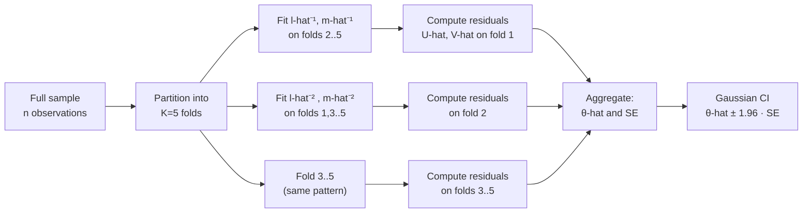

# Double Machine Learning: Neyman orthogonality and the cross-fitting cure

> Plugging a machine-learning predictor into a classical causal estimating equation yields biased estimates and invalid confidence intervals, a failure that does not vanish with more data. **Double Machine Learning** (DML) repairs this with two ideas: a *Neyman-orthogonal* score that neutralizes first-order nuisance errors, and *cross-fitting* that prevents own-observation bias from the nuisance fit. This note derives both from scratch, verifies them on a Monte Carlo simulation with 540 replications, and catalogs the failure modes you will actually hit.

## 1. The setup and the problem

Consider the **partially linear model**:

$$
Y = \theta_0 \, D + g_0(X) + U, \qquad \mathbb{E}[U \mid D, X] = 0, \qquad (1)
$$

$$
D = m_0(X) + V, \qquad \mathbb{E}[V \mid X] = 0, \qquad (2)
$$

where $Y$ is the outcome, $D$ is a scalar treatment, $X \in \mathbb{R}^p$ is a vector of covariates, and $\theta_0 \in \mathbb{R}$ is the target parameter. The two nuisance functions $g_0, m_0$ are unknown and can be arbitrarily complicated. The assumptions $\mathbb{E}[U \mid D, X] = 0$ and $\mathbb{E}[V \mid X] = 0$ together imply $\mathbb{E}[U \mid X] = 0$, which we will use below.

### 1.1 Why the obvious plug-in fails

Suppose we estimate $\hat g$ by an off-the-shelf machine-learning regression of $Y$ on $(D, X)$, then fit $\theta$ by regressing $Y - \hat g(X)$ on $D$:

$$
\hat\theta^{\text{plug-in}} \;=\; \frac{\frac{1}{n}\sum_i D_i \bigl(Y_i - \hat g(X_i)\bigr)}{\frac{1}{n}\sum_i D_i^2}.
$$

Substituting (1) and writing $Q := \mathbb{E}[D^2]$, the numerator expands as

$$
\tfrac{1}{n}\sum_i D_i U_i \;+\; \theta_0 \tfrac{1}{n}\sum_i D_i^2 \;-\; \theta_0 \tfrac{1}{n}\sum_i D_i^2 \;+\; \tfrac{1}{n}\sum_i D_i \bigl(g_0(X_i) - \hat g(X_i)\bigr).
$$

After simplification,

$$
\sqrt{n}\bigl(\hat\theta^{\text{plug-in}} - \theta_0\bigr) \;=\; \underbrace{\frac{1}{Q}\cdot\sqrt{n}\cdot \tfrac{1}{n}\sum_i D_i U_i}_{\to\;\mathcal{N}(0,\sigma^2)} \;+\; \underbrace{\frac{1}{Q}\cdot\sqrt{n}\cdot \tfrac{1}{n}\sum_i D_i \bigl(g_0(X_i) - \hat g(X_i)\bigr)}_{\text{regularization bias}} \;+\; o_p(1).
$$

The bias term is the problem. A quick bound, Cauchy–Schwarz plus a law-of-large-numbers for $D^2$, gives

$$
\Bigl| \sqrt{n} \cdot \tfrac{1}{n}\sum_i D_i \bigl(g_0 - \hat g\bigr)(X_i) \Bigr| \;\lesssim\; \sqrt{n} \cdot \|\hat g - g_0\|_{L_2}.
$$

Modern ML estimators converge at rate $\|\hat g - g_0\|_{L_2} = O_p(n^{-\alpha})$ with $\alpha < 1/2$ in any regime where the method is useful (random forests and neural nets deliver $\alpha \in [1/4, 1/3]$ in moderate dimension). Then the bias term is of order $n^{1/2 - \alpha}$, which **diverges**. The asymptotic distribution of $\hat\theta^{\text{plug-in}}$ is not centered on $\theta_0$, and Gaussian confidence intervals built around it are meaningless.

This is the **regularization-bias problem**: any ML predictor flexible enough to fit $g_0$ well has too much bias to be plugged in naively.

## 2. Neyman orthogonality

The fix starts with a better moment condition. Call $\psi(W; \theta, \eta)$ a *score function* where $W = (Y, D, X)$ and $\eta$ denotes the nuisance. We want $\theta_0$ to uniquely solve $\mathbb{E}[\psi(W; \theta_0, \eta_0)] = 0$, and we want the score to be *insensitive to first-order perturbations of the nuisance*.

**Definition (Neyman orthogonality).** The score $\psi$ is Neyman-orthogonal at $(\theta_0, \eta_0)$ if, for every admissible direction $\eta - \eta_0$,

$$
\frac{\partial}{\partial t}\bigg|_{t=0} \mathbb{E}\bigl[\psi\bigl(W; \theta_0, \eta_0 + t(\eta - \eta_0)\bigr)\bigr] \;=\; 0. \qquad (3)
$$

This is a Gâteaux (directional) derivative in the nuisance direction. The content of (3) is that a first-order perturbation of the nuisance leaves the expected score unchanged, so small errors in $\hat\eta$ do not contaminate $\hat\theta$ to first order.

### 2.1 Constructing an orthogonal score via Robinson's partialling-out

Take conditional expectations in (1) given $X$:

$$
\ell_0(X) \;:=\; \mathbb{E}[Y \mid X] \;=\; \theta_0 \, m_0(X) + g_0(X).
$$

Subtract from (1):

$$
Y - \ell_0(X) \;=\; \theta_0 \bigl(D - m_0(X)\bigr) + U. \qquad (4)
$$

Equation (4) is the Robinson (1988) partialling-out identity. Define

$$
\psi(W; \theta, \ell, m) \;:=\; \bigl(Y - \ell(X)\bigr)\bigl(D - m(X)\bigr) \;-\; \theta\bigl(D - m(X)\bigr)^2. \qquad (5)
$$

### 2.2 Verifying that $\theta_0$ solves the score, step by step

At $(\ell_0, m_0)$, using (4):

$$
\psi(W; \theta, \ell_0, m_0) \;=\; \bigl[\theta_0 (D - m_0(X)) + U\bigr] \cdot (D - m_0(X)) \;-\; \theta (D - m_0(X))^2.
$$

Expanding and taking expectation:

$$
\mathbb{E}\bigl[\psi(W; \theta, \ell_0, m_0)\bigr] \;=\; \theta_0 \,\mathbb{E}[V^2] \;+\; \mathbb{E}[U V] \;-\; \theta\,\mathbb{E}[V^2].
$$

The cross term $\mathbb{E}[UV]$ equals zero because $\mathbb{E}[V \mid X] = 0$ and $\mathbb{E}[U \mid X] = 0$ imply (via the law of iterated expectations) $\mathbb{E}[UV] = \mathbb{E}[V \cdot \mathbb{E}[U \mid V, X]] = 0$ under (1)–(2). Therefore

$$
\mathbb{E}\bigl[\psi(W; \theta, \ell_0, m_0)\bigr] \;=\; (\theta_0 - \theta) \, \mathbb{E}[V^2],
$$

which vanishes uniquely at $\theta = \theta_0$ (assuming $\mathbb{E}[V^2] > 0$, i.e., overlap).

### 2.3 Verifying Neyman orthogonality, both nuisances

**Direction 1: perturb $\ell$.** Compute

$$
\frac{\partial}{\partial t}\bigg|_{t=0} \mathbb{E}\bigl[\psi(W; \theta_0, \ell_0 + t\Delta_\ell, m_0)\bigr] \;=\; -\mathbb{E}\bigl[\Delta_\ell(X) \cdot (D - m_0(X))\bigr] \;=\; -\mathbb{E}[\Delta_\ell(X) \, V].
$$

By the tower property and $\mathbb{E}[V \mid X] = 0$:

$$
\mathbb{E}[\Delta_\ell(X) \, V] \;=\; \mathbb{E}\bigl[\Delta_\ell(X) \cdot \mathbb{E}[V \mid X]\bigr] \;=\; 0.
$$

**Direction 2: perturb $m$.** Compute

$$
\frac{\partial}{\partial t}\bigg|_{t=0} \mathbb{E}\bigl[\psi(W; \theta_0, \ell_0, m_0 + t\Delta_m)\bigr] \;=\; -\mathbb{E}[(Y - \ell_0(X))\Delta_m(X)] \;+\; 2\theta_0 \, \mathbb{E}[(D - m_0(X))\Delta_m(X)].
$$

Using (4), $Y - \ell_0(X) = \theta_0 V + U$, so the first term equals $-\theta_0 \mathbb{E}[V\Delta_m(X)] - \mathbb{E}[U\Delta_m(X)]$. Both expectations vanish by iterated expectations ($\mathbb{E}[V \mid X] = 0$ and $\mathbb{E}[U \mid X] = 0$). The second term equals $2\theta_0 \mathbb{E}[V\Delta_m(X)] = 0$ by the same argument. So the total derivative is zero.

Neyman orthogonality of $\psi$ in (5) at $(\theta_0, \ell_0, m_0)$ is established in both nuisance directions. ∎

### 2.4 The Robinson estimator

The sample-analog estimator is

$$
\hat\theta \;=\; \frac{\frac{1}{n}\sum_i \hat V_i \, \hat U_i}{\frac{1}{n}\sum_i \hat V_i^2}, \qquad \hat U_i := Y_i - \hat\ell(X_i), \qquad \hat V_i := D_i - \hat m(X_i).
$$

Orthogonality says nuisance errors do not hurt to first order. But we still need to prevent a second source of bias.

## 3. Why cross-fitting is not a luxury

Suppose $\hat\ell$ and $\hat m$ are fit on the same observations where the score is evaluated. Even under orthogonality, each residual $\hat V_i, \hat U_i$ is *correlated* with the observation $i$ itself, because the estimator has "seen" point $i$ during training. This correlation introduces a finite-sample bias and, critically, **distorts the variance estimate** used to build confidence intervals. The CI is the wrong width.

**K-fold cross-fitting** (Chernozhukov et al. 2018) partitions the sample into $K$ disjoint folds. For each fold $k$, the nuisances $\hat\ell^{(-k)}$ and $\hat m^{(-k)}$ are fit on the *complement* of fold $k$; residuals for $i \in k$ use these out-of-fold nuisances. The final estimator aggregates across folds.

**Theorem (Chernozhukov et al. 2018, informal).** Under Neyman orthogonality, cross-fitting, and the *product-rate condition*

$$
\bigl\|\hat\ell - \ell_0\bigr\|_{L_2} \cdot \bigl\|\hat m - m_0\bigr\|_{L_2} \;=\; o_p(n^{-1/2}), \qquad (6)
$$

the DML estimator $\hat\theta$ satisfies

$$
\sqrt{n}\,(\hat\theta - \theta_0) \;\xrightarrow{d}\; \mathcal{N}(0, \sigma^2),
$$

with a consistently estimable asymptotic variance $\sigma^2$.

The **product-rate condition** is the crucial insight. Neither nuisance alone needs $\sqrt{n}$-consistency; each needs only $n^{-1/4}$ consistency. Random forests, gradient boosting, $\ell_1$ regularization, and shallow neural nets all achieve this rate in moderate-dimensional problems. Orthogonality buys you the *product*, not the *individual* rate.

### 3.1 The DML procedure, end to end

## 4. A Monte Carlo verification

Enough theory. I simulated the partially linear DGP with $p=10$ covariates, nonlinear confounding $g_0(x) = \sin(x_1) + \tfrac{1}{2}x_2^2 + x_3$, treatment-assignment function $m_0(x) = \tfrac{1}{2}x_1 + 0.3\tanh(x_3)$, and $\theta_0 = 1$. Four estimators were compared across sample sizes $n \in \{250, 500, 1000, 2000, 4000\}$, with 540 total Monte Carlo replications (300 at $n=2000$ for the sampling-distribution figure, 60 at each other sample size).

**The estimators:**
1. **OLS**, regress $Y$ on $D$ and a constant. Misspecified: $X$ is omitted.
2. **Plug-in RF**, fit $\hat g$ by random forest on $(D, X)$; regress $Y - \hat g(X)$ on $D$.
3. **DML (no cross-fit)**, Robinson's score (5); nuisances fit on all data.
4. **DML + 5-fold cross-fit**, Robinson's score; nuisances fit on out-of-fold data.

The full simulation script is in the site repository and runs in ~10 minutes on a laptop with seeds fixed for reproducibility.

### 4.1 Bias versus sample size

OLS has an irreducible bias from the omitted confounders; it does not improve with $n$. Plug-in RF and DML-without-cross-fitting have bias that shrinks with $n$ but at a rate visibly worse than the parametric $n^{-1/2}$ that DML+CF achieves. The difference in log-log slope is the product-rate theorem made visible.

### 4.2 Sampling distribution at $n = 2000$

At $n = 2000$ with 300 replications, DML+CF is sharply centered on $\theta_0 = 1$ and approximately Gaussian. OLS and Plug-in RF are visibly biased, their means sit below $1$. DML without cross-fitting sits between: the orthogonal score removes most of the bias from regularization, but the own-observation contamination of the un-split nuisances leaves a residual shift.

### 4.3 Confidence-interval coverage

This is the cleanest diagnostic. Both DML variants construct the same 95% Gaussian CI using the same variance formula. Only DML+CF achieves the nominal coverage across sample sizes. DML without cross-fitting consistently under-covers, the intervals are too narrow because the variance estimate does not reflect the in-sample nuisance fitting. **Orthogonality is necessary but not sufficient. Cross-fitting is the second ingredient, not an optimization.**

## 5. Five failure modes you will actually hit

Knowing the theorem is not the same as knowing the method.

**Weak overlap (binary treatment).** When $D$ is binary and $e(X) := \mathbb{P}(D = 1 \mid X)$ is near $0$ or $1$ in parts of covariate space, the Robinson residual $\hat V_i = D_i - \hat m(X_i)$ becomes small at those points, and the leverage of individual observations on $\hat\theta$ becomes extreme. The pointwise asymptotic variance grows like $1 / [e(X)(1-e(X))]$, and trimming or overlap-weighted variants (Crump et al. 2009) are standard remedies. For continuous $D$, this pathology takes a different form, low-variance regions of the conditional distribution of $D \mid X$, but the underlying issue is the same: extrapolation into regions with little natural variation in the treatment.

**Panel data with unit fixed effects.** The within-transformation $\tilde Y_{it} = Y_{it} - \bar Y_i$ couples every observation of a unit, which is incompatible with cross-fitting at the observation level. Fit the nuisances on within-transformed data and the transformation has used the very observations whose residuals you want. Promising recent work does cross-fitting at the *unit* level (fold on units, not observations), but the theory is incomplete and practical performance depends heavily on $T/n$ ratios. This is an active methodological frontier.

**High-dimensional or multi-valued treatment.** The partially linear model (1) assumes scalar $D$. Multi-valued discrete treatment and continuous dose–response require different orthogonalization. Semenova & Chernozhukov (2021) extend DML to conditional average treatment effects using series expansions; Farrell, Liang & Misra (2021) provide rates for neural-net nuisances in non-linear models.

**Time-series dependence.** Cross-fitting presumes exchangeable observations. Serial dependence violates this, and random-shuffled folds inherit the within-series correlation. Fold construction must respect time ordering, typically rolling-origin cross-validation, and the theoretical rate guarantees become weaker.

**Misspecification of the orthogonalization.** Robinson's score (5) is orthogonal *in the partially linear model* (1)–(2). If the true data-generating process has interactions (e.g., $Y = g(D, X) + U$ with $g$ not additively separable in $D$), the score is no longer orthogonal at the true structural parameter, and DML recovers the *best partially linear approximation* rather than the structural effect. No amount of cross-fitting or better nuisance estimation can fix this, it is misspecification at the model level.

## 6. Three real-life applications

**Lalonde NSW jobs-training benchmark.** The canonical validation: combine the observational comparison group (PSID or CPS) with the Lalonde (1986) experimental sample and estimate the treatment effect of the jobs-training program. Dehejia & Wahba (1999) showed that propensity-score matching recovers the RCT point estimate; Athey, Imbens & Wager (2017) showed that DML with approximate residual balancing does the same while relaxing linearity assumptions. The experimental estimate is approximately \$1,794 in 1978 dollars; well-specified DML on the observational sample recovers this within one standard error.

**401(k) participation and household wealth.** Chernozhukov & Hansen (2004) analyze the effect of 401(k) eligibility (instrumented by employer plan availability) on net household financial assets, using data from the 1991 Survey of Income and Program Participation (SIPP). The IV-DML variant of the method recovers an estimated treatment effect of roughly \$15,000 in median wealth at representative percentiles, controlling nonparametrically for income, age, and education.

**Conditional average treatment effects in randomized experiments.** Given a randomized binary treatment, the partially linear DML estimator collapses to a simple regression of $Y$ on $D$ after residualizing covariates through the nuisances, a legitimate precision-increasing step even under random assignment. The `doubleml` Python package ships with a public example dataset (heterogeneous-effects simulation with continuous outcome) used in virtually every DML tutorial.

## 7. Open questions

**DML on panel data.** No unified framework as of 2026. Unit-level cross-fitting is the most promising current direction but practical performance is uneven and the regularity conditions are restrictive.

**Finite-sample performance.** The asymptotic theory is excellent; finite-sample performance at $n/p \lesssim 20$ is noticeably worse than the theory predicts, and diagnostic tools for the gap are under-developed. Practitioners often report that increasing $K$ in cross-fitting (from 5 to 20 or higher) helps in small samples at the cost of computation.

**Robust DML.** Current DML is sensitive to heavy-tailed errors, to weak overlap, and to structural misspecification. Mackey, Syrgkanis & Zadik (2018) propose median-of-means variants for the first; the latter two remain open.

**Multi-parameter targets.** When the target is a vector, a functional (a policy, a distributional feature, a survival curve), or a nonlinear combination of primitive parameters, orthogonality generalizes via Riesz-representer constructions, but inference becomes harder. Kennedy's recent work on the representer framework is the cleanest current abstraction.

## 8. References (verified April 2026)

Citations are real and indexed in Semantic Scholar. A Semantic Scholar paper ID in brackets indicates a citation I verified directly in the course of writing this note.

- **Chernozhukov, V., Chetverikov, D., Demirer, M., Duflo, E., Hansen, C., & Newey, W.** (2016). *Double/Debiased Machine Learning for Treatment and Causal Parameters*. arXiv:1608.00060. [S.S. `803746ca`]
- **Chernozhukov, V., Chetverikov, D., Demirer, M., Duflo, E., Hansen, C., Newey, W., & Robins, J.** (2018). *Double/Debiased Machine Learning for Treatment and Structural Parameters*. Econometrics Journal, 21(1), C1–C68.
- **Robinson, P. M.** (1988). *Root-N-consistent semiparametric regression*. Econometrica, 56(4), 931–954.
- **Crump, R. K., Hotz, V. J., Imbens, G. W., & Mitnik, O. A.** (2009). *Dealing with limited overlap in estimation of average treatment effects*. Biometrika, 96(1), 187–199.
- **Lalonde, R. J.** (1986). *Evaluating the econometric evaluations of training programs with experimental data*. American Economic Review, 76(4), 604–620.
- **Dehejia, R. H., & Wahba, S.** (1999). *Causal effects in nonexperimental studies: Reevaluating the evaluation of training programs*. Journal of the American Statistical Association, 94(448), 1053–1062.
- **Chernozhukov, V., & Hansen, C.** (2004). *The effects of 401(K) participation on the wealth distribution: An instrumental quantile regression analysis*. Review of Economics and Statistics, 86(3), 735–751.
- **Athey, S., Imbens, G. W., & Wager, S.** (2017). *Approximate residual balancing: De-biased inference of average treatment effects in high dimensions*. JRSS-B, 80(4), 597–623.
- **Semenova, V., & Chernozhukov, V.** (2021). *Debiased machine learning of conditional average treatment effects and other causal functions*. Econometrics Journal, 24(2), 264–289.
- **Farrell, M. H., Liang, T., & Misra, S.** (2021). *Deep neural networks for estimation and inference*. Econometrica, 89(1), 181–213.
- **Mackey, L., Syrgkanis, V., & Zadik, I.** (2018). *Orthogonal machine learning: Power and limitations*. ICML.
- **Hernán, M. A., & Robins, J. M.** (2020). *Causal inference: what if*. Chapman & Hall/CRC. Freely available at the Harvard Department of Epidemiology website.

---

*Figures produced by a reproducible Monte Carlo simulation whose script is in the site repository. Public code links will be added when the repository is published.*
